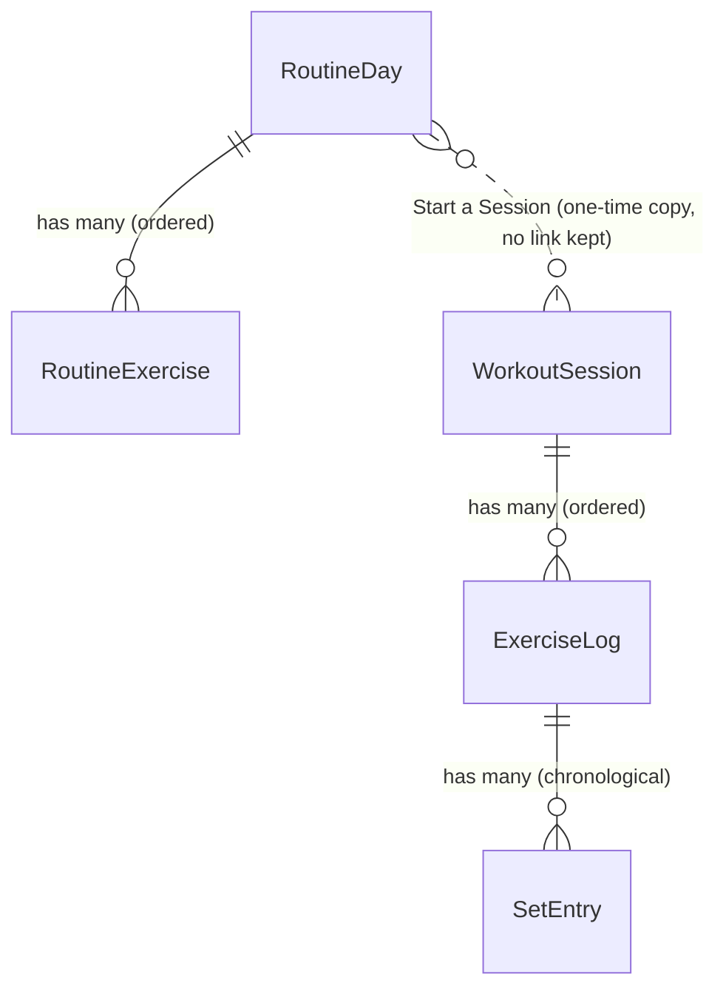
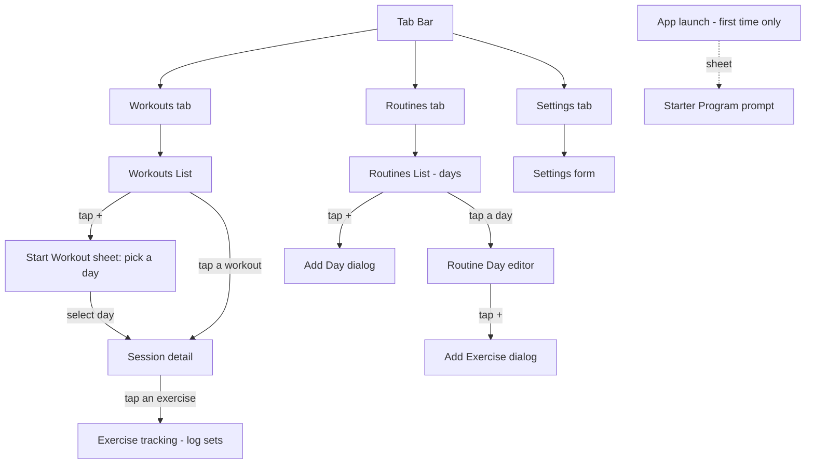

# Gym Tracking — Application Specification

> **Purpose of this document.** A complete, technology-agnostic description of every screen, flow,
> feature, data rule, and edge case in the Gym Tracking app. It is written so a team can rebuild the
> same product on a **different technology stack** (e.g. Android/Kotlin, Flutter, React Native, web)
> without reading the original Swift source.
>
> The current implementation is **iOS / SwiftUI / SwiftData / CloudKit**. Where a behaviour is purely a
> domain rule it is described abstractly; where it depends on the platform it is explicitly flagged
> as **[Platform]** so the new stack can choose an equivalent.

---

## 1. Product Overview

A **single-user** app for tracking strength-training workouts. There is no accounts/login system — the
user is implicitly identified by their device's cloud account (see §11).

The app is built around **two separate concepts** that must never be conflated:

| Concept | Mutability | Meaning |
|---|---|---|
| **Routine** (the *program*) | Editable templates | What the user *intends* to do — days and the exercises planned for each. |
| **Workouts** (the *history*) | Append-only record | What the user *actually performed*, captured as immutable snapshots. |

The single bridge between them is the **Start a Session** operation, which copies a Routine Day into a
new Workout Session. After that copy, the two are fully independent — editing the routine never alters
past workouts.

**Primary value proposition:** quick set logging during a gym session, with the previous performance of
each exercise shown so the user can progressively overload.

### Target platform (current)
- iOS, universal (iPhone + iPad).
- Deployment target: iOS 26.2 (modern OS; uses current navigation + data APIs).
- Bundle identifier: `ysh.gym-tracking`.
- Version 1.0.

---

## 2. Ubiquitous Language (Glossary)

These are the canonical terms. Internal code/docs use them exactly; the **UI** uses friendlier product
strings (also listed). When porting, keep the internal vocabulary consistent.

### Routine side (editable templates)
- **Routine Day** — an editable template grouping exercises planned for one training day. *(UI: "День" / "Day"; the collection of days is "Программа" / "Routines".)* Avoid: Plan, Program Day, Template.
- **Routine Exercise** — an exercise slot inside a Routine Day; has a name and an Exercise Metric. Avoid: Template Exercise.

### Workout side (logged history, append-only)
- **Workout Session** — a single performed workout, started from a Routine Day at a point in time. Independent of its source after creation. *(UI: "Тренировка" / "Workout".)* Avoid: Training, Session (too generic), Workout alone (ambiguous).
- **Exercise Log** — an exercise inside a Workout Session; holds the performed Sets. Avoid: Performed/Logged Exercise.
- **Set** — one performed unit within an Exercise Log: either `weight × reps` or `duration`. Avoid: Rep, Round.

### Shared vocabulary
- **Exercise Metric** — what kind of data an exercise records: `weightReps` (strength) or `duration` (timed). Set on both Routine Exercise and Exercise Log. An Exercise Log inherits its Metric from the Routine Exercise it was copied from. Avoid: Exercise Type, Mode.
- **Start a Session** — the operation that instantiates a Workout Session from a Routine Day, copying each Routine Exercise into a new Exercise Log in the same order, with the same name and Metric. The only cross-aggregate operation.
- **Previous Set** — the most recent Set recorded for a given exercise **name** in a prior Workout Session, used to pre-fill defaults when logging. Matched by name (not by relationship) so renames don't break history. Avoid: Last Set (ambiguous).

> **Key invariant — Workout Sessions are snapshots.** Once Start a Session copies a Routine Exercise
> into an Exercise Log, the two are independent. Renaming/reordering/deleting the Routine later affects
> only *future* sessions.

---

## 3. Data Model

### 3.1 Entity-relationship diagram

> Note the dashed relation: **Start a Session copies data; it does NOT store a foreign key** back to the
> Routine Day. A Workout Session has no reference to the routine it came from.

### 3.2 Entities and fields

All identifiers are UUIDs generated at creation. "Ordering" fields are explained in §3.3.

#### RoutineDay
| Field | Type | Default | Notes |
|---|---|---|---|
| `id` | UUID | new UUID | |
| `name` | String | `""` | User-facing day name (e.g. "Day A — Upper"). |
| `order` | Int | `0` | Sort position among all Routine Days. |
| `exercises` | [RoutineExercise] | `[]` | Cascade delete. Ordered by each child's `order`. |

#### RoutineExercise
| Field | Type | Default | Notes |
|---|---|---|---|
| `id` | UUID | new UUID | |
| `name` | String | `""` | |
| `order` | Int | `0` | Sort position within its Routine Day. |
| `metric` | enum `weightReps` \| `duration` | `weightReps` | Stored as a string raw value. Editable. |
| `day` | RoutineDay? | nil | Back-reference (inverse of `exercises`). |

#### WorkoutSession
| Field | Type | Default | Notes |
|---|---|---|---|
| `id` | UUID | new UUID | |
| `name` | String | `""` | Copied from the Routine Day's name at start. **Not editable in UI afterwards.** |
| `startedAt` | Date | now | When the workout happened. **Editable** via a date picker (lets the user correct/backdate). |
| `exercises` | [ExerciseLog] | `[]` | Cascade delete. Ordered by each child's `order`. |
| *(derived)* `totalSets` | Int | — | Sum of all sets across all Exercise Logs. |

#### ExerciseLog
| Field | Type | Default | Notes |
|---|---|---|---|
| `id` | UUID | new UUID | |
| `name` | String | `""` | Copied at creation; this is the snapshot name. |
| `order` | Int | `0` | Sort position within its Workout Session. |
| `metric` | enum | `weightReps` | **Read-only after creation** (chosen at copy time or in the add-exercise sheet). |
| `session` | WorkoutSession? | nil | Back-reference. |
| `sets` | [SetEntry] | `[]` | Cascade delete. Ordered by `createdAt`. |
| *(derived)* `lastSet` | SetEntry? | — | Most recent set by `createdAt` within this log. |

#### SetEntry
| Field | Type | Default | Notes |
|---|---|---|---|
| `id` | UUID | new UUID | |
| `weight` | Double | `0` | Used when metric = weightReps. Stored in the **currently selected unit** (see §7 / known issue §13). |
| `reps` | Int | `0` | Used when metric = weightReps. |
| `duration` | Int (seconds) | `0` | Used when metric = duration. |
| `createdAt` | Date | now | Determines ordering; reordering rewrites these timestamps (§3.3). |
| `exerciseName` | String | `""` | **Denormalised** copy of the parent exercise's name. Powers the Previous Set lookup without joins. |
| `exercise` | ExerciseLog? | nil | Back-reference. |

### 3.3 Ordering rules (apply uniformly)

- **Routine Days, Routine Exercises, Exercise Logs** are ordered by an explicit integer `order`.
  - New item's order = `(max existing order) + 1`; first item gets `0`.
  - **Reorder** rewrites the affected items so order is always contiguous `0..n-1`.
- **Sets** are ordered by `createdAt` (chronological).
  - **Reorder of sets is special:** moving a set does *not* renumber an `order` field — instead the
    list of `createdAt` timestamps is held fixed and re-assigned to the items in their new visual
    positions. Net effect: the displayed order changes, the timestamp "slots" stay the same. Replicate
    this if you want identical behaviour, or use an explicit order field in the new stack (simpler).

### 3.4 Validation rules
- Names are **trimmed** of leading/trailing whitespace before saving.
- A **blank/whitespace-only name is rejected** (the create call returns nothing; nothing is inserted).
- A **duration set of 0 or negative seconds is rejected** (not added).
- A **weight-reps set with weight 0 is allowed** (supports bodyweight / unloaded movements). Reps input is constrained to ≥ 1 in the UI.

---

## 4. Information Architecture & Navigation

Three primary tabs. Each tab owns its own navigation stack.

- **Tab bar items** (with current icon intent): Workouts (strength-training figure), Routines (clipboard list), Settings (gear).
- The tab bar **fully rebuilds when the UI language changes** so tab labels update immediately. **[Platform]** — a SwiftUI caching workaround; most stacks update labels automatically and won't need this.

---

## 5. Screens

Each screen below lists: purpose, layout/components, empty vs. populated states, actions, and any rules.

### 5.1 Workouts List (home / history)
**Purpose:** show all performed Workout Sessions, newest first; entry point to start a new workout.

- **Data:** all Workout Sessions sorted by `startedAt` **descending**.
- **Empty state:** centered placeholder — title "No workouts yet", a hint "Tap + to start a workout from one of your program days", and a dumbbell icon.
- **Populated state:** a list of **Session Rows**, each showing:
  - Workout name (prominent).
  - Date/time: weekday, month, day, hour, minute (localized format).
  - Summary line: `{exerciseCount} ex. · {totalSets} sets`.
- **Toolbar:** a **+** button (top-right) → opens the **Start Workout sheet**.
- **Delete:** swipe a row → fires a **warning haptic** → presents a confirmation dialog
  "Delete this workout? All recorded sets will be lost." with **Delete** (destructive) / **Cancel**.
  Confirming cascade-deletes the session and all its logs/sets.
- **Navigation:** tapping a row pushes the **Session detail**. (This stack also hosts the Exercise tracking screen.)

### 5.2 Start Workout sheet
**Purpose:** choose which Routine Day to perform.

- Presented modally from the **+** on the Workouts List.
- **Data:** all Routine Days sorted by `order`.
- **Empty state:** text "No program days yet. Add some in the Routines tab."
- **Populated:** list of days; each row shows the day name and its exercise names joined by " · "
  (truncated to 2 lines). Accessibility hint: "Start a workout from this day".
- **Action:** tapping a day immediately **Starts a Session** (see §6.1), dismisses the sheet, and
  **navigates straight into the new Session detail**.
- **Cancel** button dismisses without creating anything.

### 5.3 Session detail
**Purpose:** view/adjust one Workout Session and drill into each exercise to log sets. Works for both a
just-started session and any past session (it's the same screen).

- **Bound to** a single Workout Session (live-editable).
- **Section "Date & time":** a date+time picker bound to `startedAt`. Editing it changes when the
  workout is recorded as having happened (used for backdating / correcting).
- **Section "Exercises":**
  - List of **Exercise Rows** (see below). Tapping one pushes the **Exercise tracking** screen.
  - Swipe to delete an exercise (cascade-deletes its sets). No confirmation dialog on this swipe.
  - Footer: "Tap an exercise to record sets."
- **Section "Add exercise":** a button opening the **Add Session Exercise sheet**. Footer:
  "Add an exercise just for this workout." (i.e. a one-off, not added to the routine.)
- **Section "Delete workout":** a destructive button → **warning haptic** → confirmation dialog
  "Delete this workout? All recorded sets will be lost." → on confirm, deletes the session and
  navigates back.
- **Toolbar:** an **Edit/Done** toggle (enables reorder/delete affordances in lists).

**Exercise Row contents:**
- Exercise name (prominent).
- A status/summary line:
  - If it has at least one set: `{n} sets · last {weight}×{reps}` (weight-reps) or `{n} sets · last {M:SS}` (duration).
  - If no sets yet: `Not started · {metric short label}` where short label is "weight × reps" / "time".
- A green **checkmark** icon on the trailing edge when sets have been recorded.

### 5.4 Add Session Exercise sheet
**Purpose:** add a one-off exercise to the current Workout Session (does not touch the Routine).

- Medium-height modal form.
- **Name** text field (+ footer "Will be added to this workout only").
- **Data type** segmented picker: "Weight & reps" / "Duration". Chosen at creation because the metric
  determines which inputs the tracker shows and is **fixed for that Exercise Log afterward**.
- **Cancel** / **Add**. Add is **disabled while the name is blank**.

### 5.5 Exercise tracking (log sets)
**Purpose:** record sets for one Exercise Log. Inputs adapt to the exercise's metric.

- **Bound to** a single Exercise Log.
- **"Previous" reference section** (only if a Previous Set exists): a line "Last time: {weight}×{reps} reps"
  or "Last time: {M:SS}", with a history icon. Sourced via the Previous Set lookup (§6.2).
- **Section "New set":** inputs depend on metric —
  - **weightReps:**
    - Weight: a numeric text field (decimal keypad, right-aligned) with the unit label beside it.
    - A weight stepper "Adjust weight ({display})" ranging `0 … maxWeight` with a unit-specific step
      (kg: step 2.5, max 500; lb: step 5, max 1100).
    - A reps stepper "Reps: {n}" ranging `1 … 100`.
  - **duration:**
    - Minutes stepper `0 … 120`.
    - Seconds stepper `0 … 59`, step 5.
  - An **"Add set"** button (full-width). On a successful add → **success haptic**.
- **Section "Sets this workout":**
  - Empty state: placeholder "No sets" / hint "Enter weight and reps above, then tap Add set."
  - Populated: each set is a row "Set {n}" + value, value uses a monospaced/tabular figure style:
    `{weight} {unit} × {reps}` or `{M:SS}`.
  - Swipe to **delete** a set; **reorder** sets in edit mode (see §3.3 reorder note).
- **Toolbar:** Edit/Done toggle is shown **only when at least one set exists**.
- **Default pre-fill on open** (see §6.3): inputs are seeded so the user usually just taps "Add set".
  Cold defaults before any history: weight 0, reps 8, minutes 0, seconds 30.

### 5.6 Routines List (program days)
**Purpose:** manage the editable list of Routine Days.

- **Data:** all Routine Days sorted by `order`.
- **Empty state:** placeholder "Routines is empty" / "Add your first program day using the + button…".
- **Populated:** list (in a section) of days; each row shows the day name and `{n} exercises`.
  - Footer: "Tap a day to edit its exercises. Swipe to delete, or tap Edit to reorder."
  - Swipe to **delete** a day (cascade). **Reorder** in edit mode.
- **Toolbar:** Edit/Done toggle + a **+** button → **Add Day dialog** (a text alert with a name field,
  placeholder "e.g. Day C", Add / Cancel).
- **Navigation:** tapping a day pushes the **Routine Day editor**.

### 5.7 Routine Day editor
**Purpose:** rename a day and manage its exercises.

- **Bound to** a single Routine Day (live-editable form).
- **Section "Day name":** text field bound to the day's name (title updates live).
- **Section "Exercises":**
  - Each exercise is an **inline-editable field**: a name text field plus a **segmented metric picker**
    ("Weight & reps" / "Duration"). Both editable in place.
  - Swipe to **delete**; **reorder** in edit mode.
  - An **"Add exercise"** button → text alert with a name field, Add / Cancel.
  - Footer: "These exercises will pre-fill when you start a workout for this day."
- **Toolbar:** Edit/Done toggle.

> Renaming/reordering/deleting here affects only **future** Started Sessions, never past Workout
> Sessions (snapshot invariant, §2).

### 5.8 Settings
A form with four sections (see §7–§11 for the rules behind each):

1. **Weight** — unit picker (kg / lb). Footer: "Changing the unit converts every recorded weight automatically." Changing the unit triggers a bulk conversion (§7).
2. **Appearance** — theme picker: System / Light / Dark.
3. **Language** — interface language picker: Русский / English (shown in their own names).
4. **Sync** — an iCloud sync toggle plus a live status row (§11). Toggling shows a "Restart required" alert.

### 5.9 Starter Program prompt (first launch)
**Purpose:** offer to seed a starter program on first use instead of seeding silently.

- Presented as a sheet **once**, when the Routines list is empty and the user hasn't been asked yet
  (timing rules in §10).
- Body text: "Pick one of the built-in programs to start with, or skip and build your own."
- Three **program cards**, each with: an icon, a title, a subtitle (split/volume summary), and
  "{n} training days", with a chevron.
- Tapping a card **applies** that program (inserts its days/exercises) and dismisses.
- A **Skip** button dismisses and records the decision so the prompt never reappears.

---

## 6. Core Features & Business Rules

### 6.1 Start a Session (the cross-aggregate copy)
Given a Routine Day:
1. Create a new Workout Session with `name = day.name` and `startedAt = now`.
2. For each Routine Exercise (in `order`), create a new Exercise Log copying `name` and `metric`, with a
   fresh contiguous `order` (0,1,2,…).
3. **No link** to the Routine Day is stored. Subsequent routine edits never affect this session.
4. The session is persisted immediately and the user is navigated into it. (There is no "discard on
   empty" — a started session with no sets still exists until manually deleted.)

### 6.2 Previous Set lookup
For a given Exercise Log, find the single most recent Set such that:
- `set.exerciseName == exerciseLog.name` (matched **by name**, denormalised), **and**
- `set.createdAt < session.startedAt` (strictly before the current session started — so sets logged
  during the current session are excluded), ordered by `createdAt` descending, take 1.

Properties (verified by tests):
- Returns nothing when there is no prior history.
- Returns the most recent set across *all* prior sessions (picks the newer of two prior sessions).
- **Rename-safe:** because the match is by name, renaming the routine exercise or using a brand-new
  Exercise Log with the same name still finds the history.
- Sets inside the current session are never treated as "previous".

### 6.3 Default pre-fill when logging
On opening the Exercise tracking screen (once):
1. If this Exercise Log already has a last set, pre-fill inputs from it.
2. Look up the Previous Set; if found, store it as the "Last time" reference and — **only if there's no
   set in this log yet** — pre-fill inputs from it.
3. Otherwise fall back to cold defaults (weight 0, reps 8, 0:30).

### 6.4 Metric-adaptive behaviour
`weightReps` exercises show weight+reps inputs and summaries; `duration` exercises show a minutes/seconds
stepper and `M:SS` summaries. The metric is chosen on the Routine Exercise (editable) or at one-off add
time (fixed thereafter on the Exercise Log).

### 6.5 Editing & deletion summary
| Action | Where | Confirmation? | Effect |
|---|---|---|---|
| Delete Workout Session | Workouts list (swipe) / Session detail (button) | Yes (dialog + warning haptic) | Cascade delete session → logs → sets |
| Delete Exercise Log | Session detail (swipe) | No | Cascade delete log → sets |
| Delete Set | Exercise tracking (swipe) | No | Delete set |
| Delete Routine Day | Routines list (swipe) | No | Cascade delete day → routine exercises |
| Delete Routine Exercise | Routine Day editor (swipe) | No | Delete exercise |
| Reorder (days / exercises / sets) | Edit mode in each list | — | Rewrites ordering (§3.3) |
| Rename Routine Day / Exercise | Routine Day editor (inline) | — | Affects future sessions only |
| Edit `startedAt` | Session detail (date picker) | — | Changes the recorded workout time |

---

## 7. Weight Units

- Two units: **kg** and **lb**. Stored as a user preference (default **kg**).
- Per-unit input tuning: kg → step 2.5, max 500; lb → step 5, max 1100.
- **Display formatting:** whole numbers render without decimals ("60 kg"); non-whole render to one
  decimal ("62.5 kg"). Unit label is localized (kg/кг, lb/фунты).
- **Changing the unit converts every recorded set's weight** in place: convert all stored weights from
  the old unit to the new unit (rounded to the nearest 0.5), then save the new unit. No-op if unchanged;
  must not crash on an empty database.
- See **Known Issue §13** about conversion drift.

---

## 8. Appearance / Theme
- Three options: **System**, **Light**, **Dark**. Applied app-wide.
- Stored as a user preference (default System).

---

## 9. Localization (in-app language)
- Two languages: **Russian (default)** and **English**.
- **Runtime switching without restart:** changing the language updates all UI strings immediately.
  Strings are kept in code (not resource files) precisely so the in-app picker can change them live.
  **[Platform]** — choose any mechanism (in-memory locale + observable) that re-renders on change; the
  requirement is "no restart".
- **Important data rule:** when a starter program is applied, exercise/day names are written in the
  **language selected at that moment**. They become plain user data and **do not re-translate** if the
  user later switches language. The same is true for any names the user types.
- The full string catalog (RU/EN) is in **Appendix A**.

---

## 10. Starter Programs (seeding)

There are **three built-in programs**, each with **2 days**. They exist to give a new user a usable
program without manual entry. Full content is in **Appendix B**.

- **Fat loss** — full body, 2 days, cardio + compound lifts (icon: flame).
- **Muscle gain** — upper/lower split, 2 days, 8–12 reps (icon: dumbbell).
- **Strength** — compound lifts, 2 days, 3–5 reps (icon: bolt).

**Apply behaviour:** inserts the program's days (appended after any existing days) and their exercises,
in order, with names in the current language, then records that the seeding decision was made.

**Prompt timing rules (must replicate carefully):**
- The prompt is shown only when **(a)** the user has **not been asked before** (a sticky
  "decision made" flag is false) **and (b)** the Routines list is currently **empty**.
- A sticky flag is set to true on **either** picking a program **or** skipping — so the prompt never
  reappears.
- If data already exists when the check runs (e.g. pulled from the cloud on a second device), the flag
  is set silently and the prompt is **not** shown.
- **With cloud sync ON:** the evaluation **waits until the first cloud import has settled**, so a routine
  synced from another device isn't missed (which would otherwise cause a duplicate/stale prompt).
- **With cloud sync OFF:** no import event ever fires, so the evaluation runs **immediately on launch**.

Worked examples:
- First device of a cloud account → import completes empty → prompt shown → user picks "Fat loss" → 2 days uploaded.
- Second device of the same account → import downloads the routine → check sees non-empty data → flag set silently, no prompt.
- Sync off → prompt shown immediately on first launch.

---

## 11. Persistence & Cloud Sync

### 11.1 Storage
- Local persistent store on device. **[Platform]** — current stack uses SwiftData; any equivalent local
  DB works.
- **UI preferences (weight unit, theme, language) and the seeding/sync flags live in lightweight
  key-value storage and are intentionally NOT synced** to the cloud.

### 11.2 Cloud sync (opt-in)
- **Off by default.** Data stays on the device unless the user enables iCloud sync in Settings.
- **No application-level login.** The user is implicitly identified by the device's iCloud account.
  **[Platform]** — on a non-Apple stack you must decide an identity/sync model (e.g. account-based);
  this is the biggest porting decision. The product expectation is: "my data follows me across my own
  devices, with no separate sign-up".
- When enabled, the two aggregates (Routine + Workouts) sync via the user's **private** cloud database.
- **Toggling sync requires an app relaunch.** The store is configured once at launch from the flag;
  changing the toggle shows a "Restart required" alert and does not rebuild the store live.
- **Resilience:** if the cloud store cannot be initialized (missing entitlements, not provisioned, etc.),
  the app falls back to a purely local store so it still launches.

### 11.3 Cloud schema constraints (informed the data model)
The current backend (CloudKit private DB) imposes rules the model honours; keep them in mind if targeting
a similar sync backend:
- Every stored property is **optional or has a default value**.
- To-many relationships **default to an empty array**.
- **No unique constraints** on any attribute.

These constraints are *why* the data model uses defaults everywhere and matches Previous Sets by a
denormalised name rather than a relationship.

### 11.4 Sync status surfacing (Settings)
When sync is enabled, Settings shows a live status row combining two signals:
1. **Account availability** — whether the device is signed into the cloud account. Maps to messages:
   connected / "sign in to enable" / restricted / temporarily unavailable / couldn't determine.
2. **Live activity** — a coarse state: idle / preparing / downloading / uploading, plus a "last sync"
   relative timestamp and any error description.
- Visuals: a spinner while syncing; otherwise a green check (healthy) or an orange warning (error/
  unavailable). "Healthy" = sync enabled **and** account available **and** no last error.
- **[Platform]** — replicate as a small observable status object the Settings screen subscribes to.

---

## 12. Cross-Cutting / Non-Functional

- **Haptics** **[Platform]** — three intents: **success** (after a set is logged), **warning** (when a
  destructive confirmation appears), **selection** (toggles/mode switches). Provide equivalents or no-ops.
- **Accessibility** — list rows combine their child labels into one element; the Edit toggle, start-day
  rows, and the "sets recorded" checkmark expose hints/labels; decorative icons are hidden from
  assistive tech. Reproduce equivalent semantics.
- **Dynamic Type / scalable layout** **[Platform]** — the weight input field width scales with the user's
  text size. Honour OS text-scaling on the target platform.
- **Icons** **[Platform]** — current build uses SF Symbols (e.g. dumbbell, clipboard, gear, flame, bolt,
  clock, plus, trash, checkmark, cloud). Map each to an equivalent icon set.
- **Date/number formatting** — use locale-aware formatting; durations render as `M:SS`.
- **No network/API layer** beyond cloud sync; **no analytics, ads, notifications, or third-party SDKs**.
- **No onboarding/auth screens** beyond the starter-program prompt.

---

## 13. Known Issues / Watch-outs (carry forward or fix)

- **Weight conversion drift.** Weights are stored in the *current display unit* and bulk-converted on unit
  change, rounded to the nearest 0.5. Round-tripping kg→lb→kg can drift by ≤0.5. The clean fix in a new
  build is to **store a canonical unit (e.g. always kg) and convert only at display/edit time** — this
  removes both the drift and the need to mutate all rows on a unit change. Recommended for the rebuild.
- **Set reorder via timestamp swapping** (§3.3) is subtle. A new build should prefer an explicit `order`
  field on sets for clarity.
- **Workout name is not editable** after a session starts — confirm whether that's desired in the new
  build (it follows from the snapshot model but some users may expect to rename).
- **Started-but-empty sessions persist.** Starting a session always creates a record; there is no
  auto-cleanup if the user backs out without logging anything.

---

## 14. Rebuild Checklist (acceptance criteria)

A re-implementation is faithful when all of the following hold:

- [ ] Two independent aggregates; Start a Session copies (name, ordered exercises, metric) with no stored link.
- [ ] Editing/deleting a routine never changes any past Workout Session.
- [ ] Previous Set is matched by name, strictly before the current session's start, most-recent-wins, rename-safe.
- [ ] Default pre-fill: last set in this log → else previous set → else cold defaults (0 / 8 reps / 0:30).
- [ ] Metric drives inputs and summaries; metric editable on routine exercises, fixed on logged exercises.
- [ ] Ordering is contiguous after every reorder; new items append at the end.
- [ ] Name trimming + blank rejection; duration ≤ 0 rejected; weight 0 allowed; reps ≥ 1.
- [ ] Weight unit kg/lb with correct steps/maxes and display formatting; unit change converts existing data (or store canonical — §13).
- [ ] Theme System/Light/Dark; language RU/EN switch live without restart; seeded names don't re-translate.
- [ ] Starter prompt shown once under the empty + not-asked rules, with correct cloud-import timing.
- [ ] Opt-in sync, no login, private per-user data, restart-to-apply, graceful local fallback, live status row.
- [ ] All destructive deletes of a *workout* are confirmed; cascade deletes behave as specified.
- [ ] Three starter programs reproduced exactly (Appendix B); all UI strings reproduced (Appendix A).

---

## Appendix A — UI String Catalog (RU / EN)

> Default language is Russian. Placeholders like `{n}`, `{weight}`, `{M:SS}` mark interpolated values.

### Tabs
| Key | RU | EN |
|---|---|---|
| Workouts tab | Тренировки | Workouts |
| Routines tab | Программа | Routines |
| Settings tab | Настройки | Settings |

### Workouts list
| Key | RU | EN |
|---|---|---|
| Title | Тренировки | Workouts |
| Empty title | Пока нет тренировок | No workouts yet |
| Empty hint | Нажмите +, чтобы начать тренировку по одному из дней программы. | Tap + to start a workout from one of your program days. |
| New workout | Новая тренировка | New workout |
| Delete confirm | Удалить тренировку? Все записанные подходы будут потеряны. | Delete this workout? All recorded sets will be lost. |
| Summary | {n} упр. · {m} подходов | {n} ex. · {m} sets |
| Delete / Cancel / Add | Удалить / Отмена / Добавить | Delete / Cancel / Add |

### Start workout sheet
| Key | RU | EN |
|---|---|---|
| Title | Начать тренировку | Start workout |
| Day hint | Начать тренировку по этому дню | Start a workout from this day |
| No days | Дней программы пока нет. Добавьте в разделе «Программа». | No program days yet. Add some in the Routines tab. |

### Routines
| Key | RU | EN |
|---|---|---|
| Title | Программа | Routines |
| Empty title | Программа пуста | Routines is empty |
| Empty hint | Добавьте первый день программы кнопкой + в правом верхнем углу. | Add your first program day using the + button in the top right. |
| Exercises count | {n} упражнений | {n} exercises |
| Footer | Нажмите на день, чтобы изменить упражнения. Смахните для удаления или нажмите иконку «Изменить» для изменения порядка. | Tap a day to edit its exercises. Swipe to delete, or tap Edit to reorder. |
| Add day | Добавить день | Add day |
| New day (dialog) | Новый день программы | New routine day |
| New day placeholder | напр. День C | e.g. Day C |
| Day name section/field | Название дня | Day name |
| Add exercise | Добавить упражнение | Add exercise |
| Exercises section | Упражнения | Exercises |
| Routine exercises footer | Эти упражнения подставляются при старте тренировки по этому дню. | These exercises will pre-fill when you start a workout for this day. |
| New exercise | Новое упражнение | New exercise |
| Exercise name | Название упражнения | Exercise name |
| Data type | Тип данных | Data type |

### Session detail
| Key | RU | EN |
|---|---|---|
| Date & time section | Дата и время | Date & time |
| Workout start | Начало тренировки | Workout start |
| Exercises footer | Нажмите на упражнение, чтобы записать подходы. | Tap an exercise to record sets. |
| Add-exercise footer | Добавить упражнение только для этой тренировки. | Add an exercise just for this workout. |
| Delete workout | Удалить тренировку | Delete workout |
| Add-exercise message | Будет добавлено только к этой тренировке. | Will be added to this workout only. |
| Delete confirm | Удалить эту тренировку? Все записанные подходы будут потеряны. | Delete this workout? All recorded sets will be lost. |
| Summary (duration) | {n} подходов · посл. {M:SS} | {n} sets · last {M:SS} |
| Summary (weight×reps) | {n} подходов · посл. {weight} × {reps} | {n} sets · last {weight} × {reps} |
| Not started | Не начато · {metric} | Not started · {metric} |
| Sets recorded (a11y) | Подходы записаны | Sets recorded |

### Exercise tracking
| Key | RU | EN |
|---|---|---|
| New set section | Новый подход | New set |
| Minutes stepper | Минуты: {n} | Minutes: {n} |
| Seconds stepper | Секунды: {n} | Seconds: {n} |
| Weight label | Вес | Weight |
| Adjust weight | Изменить вес ({display}) | Adjust weight ({display}) |
| Reps stepper | Повторения: {n} | Reps: {n} |
| Add set | Добавить подход | Add set |
| Sets-this-workout section | Подходы за тренировку | Sets this workout |
| No sets title | Подходов нет | No sets |
| No sets hint | Заполните вес и повторения выше и нажмите «Добавить подход». | Enter weight and reps above, then tap Add set. |
| Set number | Подход {n} | Set {n} |
| Last time (duration) | Прошлый раз: {M:SS} | Last time: {M:SS} |
| Last time (weight×reps) | Прошлый раз: {weight} × {reps} повт. | Last time: {weight} × {reps} reps |

### Metric labels
| Key | RU | EN |
|---|---|---|
| weightReps (label) | Вес и повторения | Weight & reps |
| duration (label) | Время выполнения | Duration |
| weightReps (short) | вес × повт. | weight × reps |
| duration (short) | время | time |

### Starter program prompt
| Key | RU | EN |
|---|---|---|
| Title | Готовая программа | Starter program |
| Body | Можно начать с одной из готовых программ или пропустить и собрать свою. | Pick one of the built-in programs to start with, or skip and build your own. |
| Skip | Пропустить | Skip |
| Days count | {n} дня тренировок | {n} training days |

### Settings — general
| Key | RU | EN |
|---|---|---|
| Title | Настройки | Settings |
| Weight section | Вес | Weight |
| Weight unit picker | Единицы веса | Weight unit |
| Weight unit footer | При смене единиц все записанные веса будут автоматически пересчитаны. | Changing the unit converts every recorded weight automatically. |
| kg / lb | кг / фунты | kg / lb |
| Appearance section | Внешний вид | Appearance |
| Theme picker | Тема | Theme |
| Theme: System/Light/Dark | Системная / Светлая / Тёмная | System / Light / Dark |
| Language section | Язык | Language |
| Language picker | Язык интерфейса | Interface language |

### Settings — sync
| Key | RU | EN |
|---|---|---|
| Sync section | Синхронизация | Sync |
| Toggle label | Синхронизация через iCloud | iCloud sync |
| Footer | Когда включено, тренировки и программа синхронизируются между вашими устройствами через iCloud. По умолчанию данные хранятся только на этом устройстве. | When on, your workouts and routine sync between your devices via iCloud. Off by default — data stays on this device. |
| Restart title | Требуется перезапуск | Restart required |
| Restart message | Полностью закройте приложение и откройте его заново, чтобы изменения синхронизации вступили в силу. | Quit the app fully and reopen it for the sync change to take effect. |
| OK | ОК | OK |
| Status: available | iCloud подключён | iCloud connected |
| Status: no account | Войдите в iCloud в настройках устройства, чтобы включить синхронизацию. | Sign in to iCloud in device settings to enable sync. |
| Status: restricted | iCloud ограничен на этом устройстве. | iCloud is restricted on this device. |
| Status: temporarily unavailable | iCloud временно недоступен. | iCloud is temporarily unavailable. |
| Status: undetermined | Не удалось определить статус iCloud. | Couldn't determine iCloud status. |
| Activity: setup | Подготовка синхронизации… | Preparing sync… |
| Activity: importing | Загрузка из iCloud… | Downloading from iCloud… |
| Activity: exporting | Отправка в iCloud… | Uploading to iCloud… |
| Error title / generic | Ошибка синхронизации | Sync error |
| Last updated | Последняя синхронизация: {relativeTime} | Last sync: {relativeTime} |

### Edit toggle
| Key | RU | EN |
|---|---|---|
| Done / Edit | Готово / Изменить | Done / Edit |
| Hint (exit) | Выйти из режима редактирования списка | Exit list editing mode |
| Hint (enter) | Войти в режим редактирования: можно удалять и менять порядок | Enter editing mode: delete or reorder items |

---

## Appendix B — Starter Program Content

Each program has 2 days. `D` = duration metric; otherwise weight × reps. Exercise names shown RU / EN.

### Program 1 — Fat loss (Похудение) · icon: flame
Subtitle RU: "Полное тело · 2 дня · кардио + многосуставные" — EN: "Full body · 2 days · cardio + compound lifts"

**Day A — Полное тело / Full body**
1. Велотренажёр / Bike — **D**
2. Приседания с гантелями / Goblet squat
3. Тяга верхнего блока / Lat pulldown
4. Жим гантелей на наклонной / Incline dumbbell press
5. Румынская тяга с гантелями / Dumbbell Romanian deadlift
6. Планка / Plank — **D**

**Day B — Полное тело / Full body**
1. Эллипс / Elliptical — **D**
2. Жим ногами / Leg press
3. Горизонтальная тяга / Seated cable row
4. Жим гантелей сидя / Seated dumbbell press
5. Выпады с гантелями / Dumbbell walking lunges
6. Скручивания / Crunches

### Program 2 — Muscle gain (Набор массы) · icon: dumbbell
Subtitle RU: "Сплит верх/низ · 2 дня · 8–12 повторений" — EN: "Upper/lower split · 2 days · 8–12 reps"

**Day A — Верх / Upper**
1. Жим штанги лёжа / Barbell bench press
2. Тяга верхнего блока / Lat pulldown
3. Жим гантелей сидя / Seated dumbbell press
4. Горизонтальная тяга / Seated cable row
5. Подъём гантелей на бицепс / Dumbbell curl
6. Разгибание на трицепс на блоке / Triceps pushdown

**Day B — Низ / Lower**
1. Приседания со штангой / Barbell back squat
2. Румынская тяга со штангой / Barbell Romanian deadlift
3. Жим ногами / Leg press
4. Сгибания ног лёжа / Lying leg curl
5. Подъёмы на носки стоя / Standing calf raise
6. Подъёмы ног в висе / Hanging leg raise

### Program 3 — Strength (Сила) · icon: bolt
Subtitle RU: "Базовые упражнения · 2 дня · 3–5 повторений" — EN: "Compound lifts · 2 days · 3–5 reps"

**Day A — Присед и жим / Squat & press**
1. Приседания со штангой / Back squat
2. Жим штанги лёжа / Bench press
3. Тяга штанги в наклоне / Barbell row
4. Планка / Plank — **D**

**Day B — Тяга и жим над головой / Deadlift & overhead**
1. Становая тяга / Deadlift
2. Жим штанги стоя / Standing overhead press
3. Подтягивания / Pull-up
4. Планка / Plank — **D**

---

## Appendix C — Persisted Preference Keys (current build)

For reference when migrating local settings; all are simple key-value entries (not synced).

| Key | Meaning | Default |
|---|---|---|
| `weightUnit` | Selected weight unit (`kg`/`lb`) | `kg` |
| `appearancePreference` | Theme (`system`/`light`/`dark`) | `system` |
| `appLanguage` | UI language (`ru`/`en`) | `ru` |
| `iCloudSyncEnabled` | Whether cloud sync is on | `false` |
| `didCompleteInitialSeed` | Sticky flag: starter-program decision made | `false` |

---

*End of specification.*
